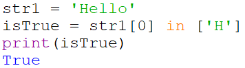
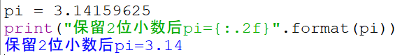
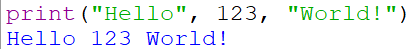
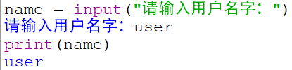

## Day 1


### 前言

- Python是一种脚本语言，通过`解释器`对代码逐行`解释`并执行获得输出结果，只要代码存在就能实现功能，与之相对的，C/C++、Java等则需要通过`编译器`将源代码进行`编译`，得到兼容于目标平台的代码后执行获得结果。
- 脚本语言的优势在于跨平台，代码即功能，但`解释`的效率往往很难得到优化，因而效率低；编译语言相对来说运行效率更高，但容易受到平台的限制。
- 掌握`IPO`的编程思维
  - `I`即input，即程序的输入，程序需要获取什么类型的数据
  - `P`即Process，即对输入的数据进行什么样的处理，对数据进行处理的方法也统称为**算法**
  - `O`即output，即程序的输出，程序最终要实现的功能是什么


### 数据类型

- 字符串

  - 由单/双引号囊括的0个或多个字符组成的有序字符序列，例如

    ```py
    str1 = "Hello"
    ```

    对于一段字符串，可以采用正向或逆向的顺序给每个字符编号

    | 某个字符串str1 |  H   |  e   |  l   |  l   |  o   |
    | :------------: | :--: | :--: | :--: | :--: | :--: |
    |  正向递增序号  |  0   |  1   |  2   |  3   |  4   |
    |  反向递减序号  |  -5  |  -4  |  -3  |  -2  |  -1  |

  - 获取字符串中的字符

    - **索引**：返回字符串中的单个字符 `<字符串>[序号]`

      如 `str1[0] = 'H'`

    - **切片**：返回字符串中的一段字符字串 `<字符串>[起始序号:结尾序号]`

      如`str1[0:4] = 'Hell'`（获取由第0个到第3个字符组成的字符串，区间左闭右开）

- 列表

  - 由0个或多个数据组成的有序序列，例如

    ```py
    ['元素1', '元素2', '元素3', ...]
    ```

  - 使用保留字`in`判断一个元素是否在列表中，如果存在（即与列表中某个元素相等）则返回`True`，否则返回`False`，例如

    ```py
    # 将字符串"Hello"存储在指向str1的变量
    str1 = 'Hello'
    # 判断str1中首个字符是否是大写H，并将判断结果赋给isTrue变量
    isTrue = str1[0] in ['H'] 
    # 打印结果
    print(isTrue) 
    ```

    

- 整数和浮点数

  - 对应数学中的整数和实数，也包括正数和负数
  - 整数：2、3、5
  - 浮点数：-1.8、1.8、1.0


### 变量

- 变量采用**标识符（名字）**表示，关联**标识符**的过程叫命名，这个过程使用**赋值符号**`=`连接

  格式为：`<变量名> = 变量存储的内容`

- 变量名的合法构成：大小写字母、数字、下划线、<u>汉字</u>等字符及组合

- 变量命名的规则

  1. **大小写敏感**，`a`和`A`代表两个变量

  2. 标识符<u>不能以数字开头</u>，如`123a`是不合法的标识符

  3. 标识符不能是python内置的**保留字（关键字）**，如`in` `if`等也不合法，但`IF` `iF` `If`是合法的

  4. python中的保留字共33个

     |  and  |  as  |  assert   |  break   | class  | continue |
     | :---: | :--: | :-------: | :------: | :----: | :------: |
     |  def  | del  |   elif    |   else   | except | finally  |
     |  for  | from | **False** |  global  |   if   |  import  |
     |  in   |  is  |  lambda   | nonlocal |  not   | **None** |
     |  or   | pass |   raise   |  return  |  try   | **True** |
     | while | with |   yield   |          |        |          |

     > 需要注意其中True、False、None首字母是大写的

- 变量命名的例子

  ```py
  text1 = 'Hello' # 将字符串"Hello"赋值给变量text1
  num1 = 13 # 将整数13赋值给变量num1
  num2 = 3.1415 # 将实数3.1415赋值给变量num2
  ```


### 缩进与语句(赋值、注释、分支)

- **缩进**

  - Python采用代码缩进和冒号`:`来区分代码块之间的层次。一般采用4个空格长度作为一个缩进量（有时为了多层嵌套的可读性，也采用2个空格）

  - 对于类定义、函数定义、流程控制语句、异常处理语句等，行尾的冒号和下一行的缩进，表示下一个代码块的开始，而缩进的结束则表示此代码块的结束

  - 缩进针对于**逻辑行**，与此进行区分的是**物理行**[^1]

    - **物理行**：编辑器中显示的每一行内容即为一个物理行

      - 字典、列表等变量赋值语句，可以直接书写为多个物理行

        ```py
        a = ['A', 'B', 'C'] # 单行书写
        
        a = ['A', # 多行书写
            'B',
            'C'
            ]
        ```

    - **逻辑行**：Python解释器对代码进行解释，一个语句即为一个逻辑行

    - 使用`\`符号连接两个物理行（单行语句多行书写）

      ```py
      print("Hello\
      World")
      ```

    - 使用`;`将两个或多个逻辑行合并成一个物理行

  - 缩进的规则

    - 逻辑行”首行“需要顶格（无缩进）
    
    - 相同逻辑层保持相同的缩进
    
    - 用`:`标记一个新的逻辑层，增加缩进则进入下一个代码层，减少缩进则返回上一个代码层
    
      ```py
      a = 1
      if a == 1:
          print(a) # 该行增加缩进，进入了if条件为真执行的代码层
      a += 1 # 该行减少了缩进，返回了与if同层的代码（即if不执行时执行该条语句）
      ```
    
      

- **赋值语句**：由**赋值符号**`=`构成的一行代码，如

  ```py
  a = 1 # 将1赋值给变量a
  ```

  

- **注释语句**：计算机跳过不执行的部分[^2]

  - 单行注释：由`#`开头到该行结束为止的内容

    ```py
    print("Hello World") # 这是一条单行注释
    ```

  - 多行注释：由三个`''`或`""`组成开头和结尾的囊括在其中的内容，可以写成单行也可以跨行

    ```py
    '''
    这是多行注释
    '''
    
    """注释写在一对引号之间"""
    ```

    > 当将注释写在print语句中时，解释器会认为注释外层的引号是字符串的一部分，将其解释成字符串
    
    

- **分支语句**：由判断条件决定程序运行方向的语句，使用保留字`if` `elif` `else`构成

  `<保留字> 判断条件 : `，其中`:`不可省略

  例子：

  ```py
  a = 10
  if a>5 : print(a-5) # a大于5则打印a-5的值
  elif a<5 : print(a+5) # a小于5则打印a+5的值
  else: print(a) # 上述条件都不成立，打印a的值
  ```


### 标准输入输出函数

- 输出函数`print()`

  1. 打印字符串 `print("字符串")`

     ```py
     # 在控制台上会出现Hello, World!字样
     print("Hello, World!")
     ```

  2. 格式化输出 `print("字符串{:格式}格式化变量".format(格式化变量))`

     ```py
     # 打印保留2位小数后的pi
     pi = 3.14159625
     print("保留2位小数后pi={:.2f}".format(pi))
     ```

     

  3. 逗号输出，一条print语句可以同时输出多个数据，中间以逗号隔开，数据之间会被填充空格（默认）

     ```py
     print("Hello", 123, "World!")
     ```

     

  

- 输入函数`input()`

  - `<变量> = input("提示信息字符串")` 将输入的信息以字符串形式保存到变量中

  	```py
  	name = input("请输入用户名字:")
  	print(name)
  	```

  	
  	
  	
  
- 评估函数`eval()`

  - 去除参数最外侧引号并执行余下语句的函数

    ```py
    eval("1+2") # 结果为3
    eval("'1+2'") # 结果为'1+2'
    eval("print('Hello')") # 结果为Hello
    ```

    


### 参考资料

[^1]:[python 的缩进这么简单，一分钟让你学会 - 知乎 (zhihu.com)](https://zhuanlan.zhihu.com/p/391795486)
[^2]:[Python注释（多行注释和单行注释）用法详解 (biancheng.net)](http://c.biancheng.net/view/2170.html)
