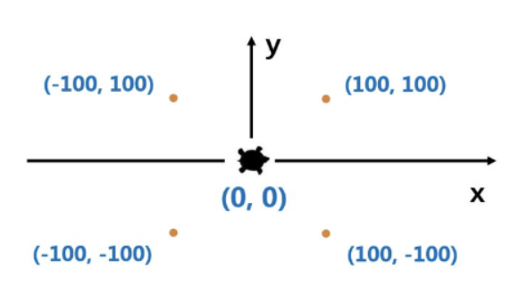
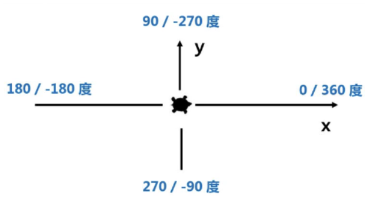
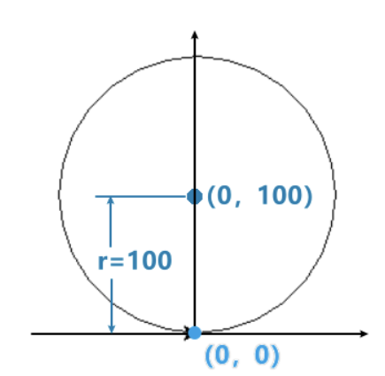
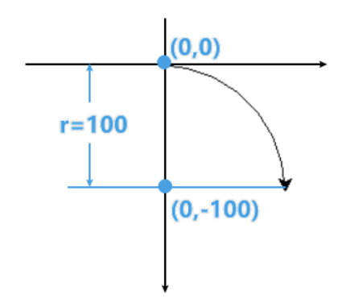

## Day2


### Python计算生态

`Python计算生态=标准库+第三方库`

- **标准库**：随解释器安装到操作系统中的功能模块
- 第三方库：需要经过安装才能使用的功能模块
- **模块**：库<u>Library</u>、包<u>Package</u>、模块<u>Module</u>


### 导入/引用库

1. 使用`import`保留字，扩充Python程序功能的方式，格式为

   `import <库名>`，使用函数时采用`<库名>.<函数名>(参数)`，如

   ```py
   import turtle
   turtle.fd(10)
   ```

2. 使用`import`和`from`保留字，格式为`from <库名> import <函数名>`或`from <库名> import *`，使用函数时采用`<函数名>(参数)`

   ```py
   from turtle import *
   fd(10)
   ```

3. 使用`import`和`as`保留字，格式为`import <库名> as <库别名>`

   使用函数时采用`<库别名>.<函数名>(参数)`

   ```py
   import turtle as t
   t.fd(10)
   ```

4. 引用外部库时**注意避免重名问题**


### Turtle（海龟）标准库

- Python的标准绘图库之一，最小单位是像素

- 空间坐标体系

  - 起始位置在画布正中间`(0,0)`，向右为x轴正向，向上为y轴正向

    

  - 海龟的行进方向：前进和后退，左侧或右侧

- 角度坐标体系

  - 

    

- 函数使用

  1. `turtle.setup(width, height, startX, startY)`

     **控制窗体的大小和位置**

     `width`：窗体的宽度

     `height`：窗体的高度

     `startX/Y`：窗体左上角相对于屏幕左上角的位置（可选参数，默认在正中间）

  2. `turtle.goto(x,y)` **从当前位置到达`(x, y)`的位置**


### RGB色彩模式

- 红绿蓝三通道颜色的组合，如`(255,255,255)`表示白色

- RGB可用整数值或小数值表示，海龟库默认使用小数值

- 使用`turtle.colormode(mode)`切换rgb数值模式

  mode为1.0时采用小数值，为255时采用整数值

- 常用RGB色彩

  | 英文名称 |   RGB整数值   | RGB小数值 | 中文名称 |
  | :------: | :-----------: | :-------: | :------: |
  |  white   | 255，255，255 |  1，1，1  |   白色   |
  |  yellow  |  255，255，0  |  1，1，0  |   黄色   |
  | magenta  |  255，0，255  |  1，0，1  |   洋红   |
  |   cyan   |  0，255，255  |  0，1，1  |   青色   |
  |   blue   |   0，0，255   |  0，0，1  |   蓝色   |
  |  black   |    0，0，0    |  0，0，0  |   黑色   |

  

### 海龟画笔控制函数

  画笔设置后一直有效，直至下次重新设置

  1. `turtle.penup()`或`turtle.pu()` 抬起画笔（无轨迹）
  
  2. `turtle.pendown()`或`turtle.pd()` 落下画笔（有轨迹）
  
  3. `turtle.pensize(d)`或`turtle.width(d)` 画笔宽度
  
  4. `turtle.pencolor(color)` 画笔颜色（color为颜色字符串或RGB值）
  
     ```py
     import turtle as t
     t.pencolor("purple") # 小写的字符串purple
     t.pencolor(0.63, 0.13, 0.94) # RGB小数值
     t.pencolor((0.63, 0.13, 0.94)) # RGB元组值
     ```
  
     

  ### 海龟运动控制函数

​	控制海龟行进：直线或曲线运动

1. `turtle.forward(d)`或`turtle.fd(d)` 朝海龟的正前方向行进（d可正可负）

2. `turtle.backward(d)`或`turtle.bd(d)` 朝海龟的反方向行进

3. `turtle.circle(r,angle)` 绘制一段**半径为r**，**角度为angle**的弧线，圆心默认在海龟前进方向左侧**r**距离的位置，角度默认为**360°**

   ```py
   import turtle as t
   t.circle(100) # 绘制半径为100，角度为360的弧线
   ```

   

   ```py
   import turtle as t
   t.circle(-100, 90) # 在下方绘制一个半径100角度90的弧
   ```

   

### 海龟方向控制函数

1. `turtle.setheading(angle)`或`turtle.seth(angle)`

   改变行进方向，海龟走角度，angle为绝对角度

2. `turtle.left(angle)`和`turtle.right(angle)`

   angle为海龟行进方向上向左或向右的角度


### 循环语句

按照一定次数循环执行一组语句

1. `for <变量> in range (参数): 语句` （变量存储循环的计数）

	```py
	# 打印0到4的数
	for i in range(5):
    	print(i)
	```

2. `range()`函数（不可打印出数）

   1. `range(N)` 产生`0`到`N-1`的整数序列

      ```py
      range(5) # 0 1 2 3 4
      ```

   2. `range(M, N)` 产生从`M`开始到`N-1`的整数序列

      ```py
      range(2, 5) # 2 3 4
      ```
